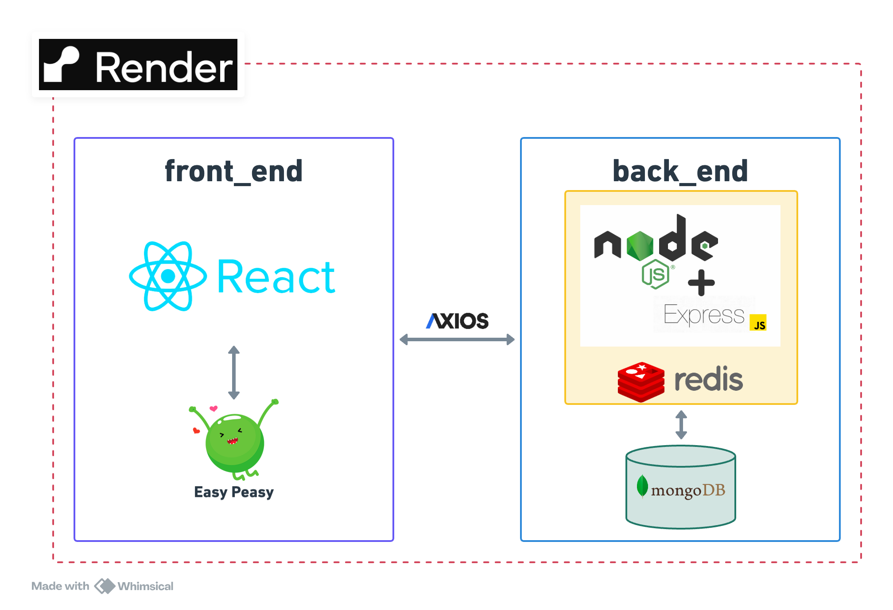

# MERN (MongoDB Express React Node.js) 架構開發書店網站(Front_end)

網站連結：[bookShop](https://bookshop-8u9l.onrender.com)

## 描述

使用 React 開發前端，React-router 處理路由部分，Easy-peasy 管理 store

## 系統架構

## 操作影片

https://github.com/Robert12280/bookShop_backend/assets/80948837/e557ec66-94b7-4aa2-8944-72b0f301935a
